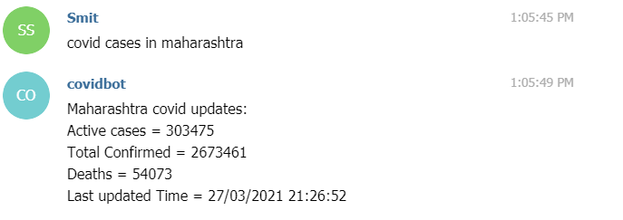
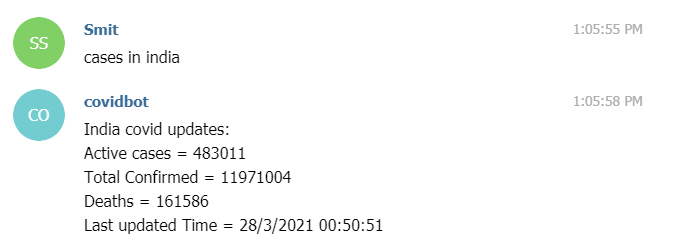
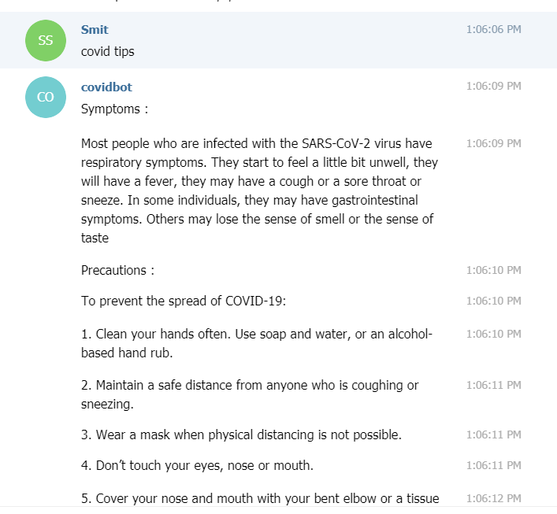
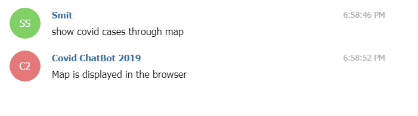
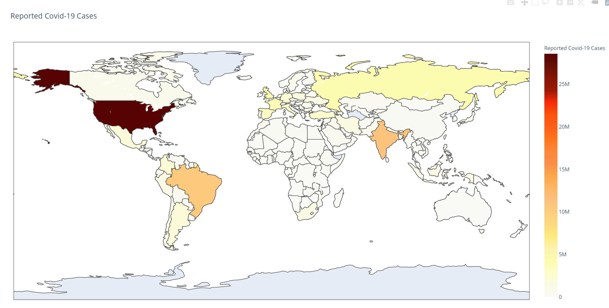

# | COVID CHATBOT |

## Readme Flow

1. <a href="#1">What is RASA?</a>
2. <a href="#2">Sample Screenshots</a>
3. <a href="#3">How to Run?</a>
4. <a href="#4">Techstack</a>

## What is RASA?

`Rasa is a tool to build custom AI chatbots using Python and natural language understanding (NLU). Rasa provides a framework for developing AI chatbots that uses natural language understanding (NLU). It also allows the user to train the model and add custom actions.`

  

## **_Some screenshots to check the demo_**

### **Asking for covid cases in \***Maharashtra**\***

### **Asking for covid cases in \***INDIA**\***

### **Asking for covid tips**

### **Asking for covid updates through mail**

### **Asking for map from chatbot**

#### How To Run

1.  Clone the code
2.  Download all the dependencies with command `pip3 install -r requirements.txt`
3.  Run `rasa train` command
4.  Run `rasa shell` and `rasa run` actions side by side on two terminals
5.  Query your commands in `rasa shell` to test the **_chat chatbot_**.

### Tech stack

`Implemented on` : **Visual Studio**  

`Language` : **Python** 

`Framework` : **Rasa**  
